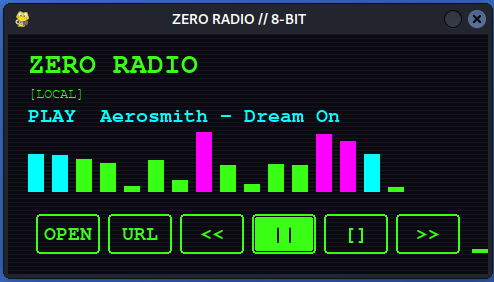

# Zero Radio

Lecteur mp3, webradio, url

## Description

Zero Radio est une application Python permettant de lire des fichiers MP3, des webradios et des flux audio à partir d'URLs.
Et est un module compris dans les tools de Zer0🤖.

## Fonctionnalités

- 🎵 Lecture de fichiers MP3 locaux
- 📻 Lecture de webradios en streaming
- 🔗 Lecture d'URL audio directes
- Interface utilisateur intuitive

## Screenshot



## Installation

Assurez-vous d'avoir Python installé sur votre système, puis clonez ce repository :

```bash
git clone https://github.com/Richerrail/Zero_Radio.git
cd Zero_Radio
```

## Utilisation

Lancez l'application :

```bash
python zero_radio.py
```

## Licence

Ce projet est sous licence MIT. Voir le fichier [LICENSE](LICENSE) pour plus de détails.


## Soutenez le projet

<p align="center">
  <a href="https://www.buymeacoffee.com/richerrailk" target="_blank" rel="noopener noreferrer">
    
  </a>
</p>
